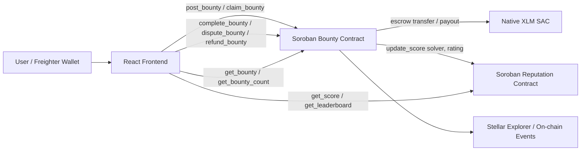

# BountyBoard

[](https://github.com/tanmayy08/Bountyboard/actions/workflows/test.yml)

> Post it. Claim it. Get paid on-chain.

BountyBoard is a Stellar bounty marketplace where clients escrow XLM in a Soroban contract, solvers claim work, and successful completions update solver reputation on chain.

Live demo: pending Vercel deployment

## Deployed Testnet Contracts

- Bounty contract: `CABL66SDTH5Y4F7CH5QKXIYCMHLF6OQOBZRJVRIWYWQACWHIFHMYTQTK`
- Reputation contract: `CCPQZ6JIM3GQFKFJUEK2HEUS5I4HSH74W2DCDHQRWQVNDY5YBLWYCFML`
- Native XLM token contract: `CDLZFC3SYJYDZT7K67VZ75HPJVIEUVNIXF47ZG2FB2RMQQVU2HHGCYSC`
- Reputation deploy tx: `e78d29c2698acbaf28ee39745d1241f9589ce82c06aff5fb9a4c2ba7a74347a3`
- Bounty deploy tx: `20fef3c97b59fcf8a7b347b98c2b1141ebfa3ee455934aab8fc826e83cb75b2f`

## Verified Testnet Flow

- Posted bounty tx: `1a132bcc46b993e65618ad7112fe7b59295a34eae4eb96ce6ab9dd8dbd9497f7`
- Claimed bounty tx: `5522864f650096aa19cc3a826367627f3cf47fa97006694a219da1b5ad0f1454`
- Completed bounty tx: `e2ca7064bcc367e18e48c562dd6c31c285384a619a317851ba9c82981ba21149`
- Final bounty status: `Completed`
- Solver reputation: `completed = 1`, `disputed = 0`, `score = 100`

## What It Does

- Lets clients post bounties with title, description, amount, and deadline.
- Locks XLM in a non-custodial Soroban escrow contract.
- Lets solvers claim open bounties.
- Lets clients complete a claimed bounty and release funds to the solver.
- Calls a separate reputation contract when work is completed.
- Reopens disputed bounties so another solver can claim them.
- Allows client refunds when an open bounty passes its deadline.
- Shows bounty listings, bounty detail, posting, solver profile, and leaderboard views.
- Uses Freighter for wallet connection and transaction signing.

## Architecture

BountyBoard is organized as a wallet-connected React frontend and two Soroban contracts.



How it works:

1. A client connects Freighter on Stellar Testnet.
2. The client posts a bounty and authorizes an XLM transfer into the bounty contract.
3. The bounty contract stores the bounty as `Open`.
4. A solver claims the bounty, moving it to `Claimed`.
5. The client completes the bounty with a rating.
6. The bounty contract releases escrowed XLM to the solver.
7. The bounty contract calls `reputation_contract::update_score(solver, rating)`.
8. The solver's on-chain reputation and leaderboard position update.

Dispute path:

```text
Open -> Claimed -> Disputed -> Open
```

Refund path:

```text
Open -> Refunded
```

## Contract Functions

### Bounty Contract

- `post_bounty(client, title, description, amount, deadline) -> bounty_id`
- `claim_bounty(bounty_id, solver)`
- `complete_bounty(bounty_id, rating)`
- `dispute_bounty(bounty_id)`
- `refund_bounty(bounty_id)`
- `get_bounty(bounty_id)`
- `get_bounty_count()`

### Reputation Contract

- `update_score(solver, rating)`
- `get_score(solver)`
- `get_leaderboard()`

## Repository Structure

```text
contracts/
  bounty/        Soroban escrow and bounty lifecycle contract
  reputation/    Soroban solver reputation contract
frontend/        React + TypeScript + Vite frontend
.github/         GitHub Actions test and Vercel deploy workflows
```

## Local Setup

### Contracts

```bash
rustup target add wasm32-unknown-unknown
cargo install --locked stellar-cli
cargo test
stellar contract build
```

### Frontend

```bash
cd frontend
npm install
npm run dev
```

Create `frontend/.env`:

```env
VITE_STELLAR_NETWORK=testnet
VITE_BOUNTY_CONTRACT_ID=CABL66SDTH5Y4F7CH5QKXIYCMHLF6OQOBZRJVRIWYWQACWHIFHMYTQTK
VITE_REPUTATION_CONTRACT_ID=CCPQZ6JIM3GQFKFJUEK2HEUS5I4HSH74W2DCDHQRWQVNDY5YBLWYCFML
VITE_READ_SOURCE_ADDRESS=GDYC2AUKPBCFS24PIUYXUWPYL46QIQCELNUPTXA6B4SNNNTQJM2BBVP7
```

Freighter must be switched to Testnet before posting, claiming, completing, disputing, or refunding bounties.

## Test Commands

```bash
cargo test
cd frontend && npm run build
```

Current test coverage includes:

- `test_post_bounty`
- `test_claim_bounty`
- `test_complete_bounty_and_reputation_update`
- `test_dispute_reopens_bounty`
- `test_refund_on_deadline`
- `test_reputation_score_calculation`

## Screenshot Checklist


## Demo Video


## Tech Stack

- Smart contracts: Rust + Soroban SDK
- Escrow token: Native XLM Stellar Asset Contract on testnet
- Frontend: React, TypeScript, Vite, Tailwind CSS
- Wallet: Freighter
- Chain reads and writes: Stellar RPC + Soroban contract invocation
- CI/CD: GitHub Actions
- Hosting: Vercel
